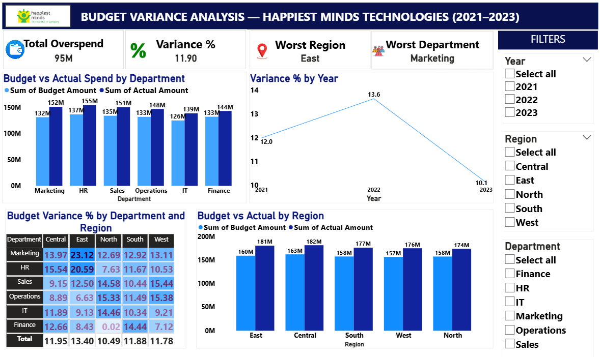
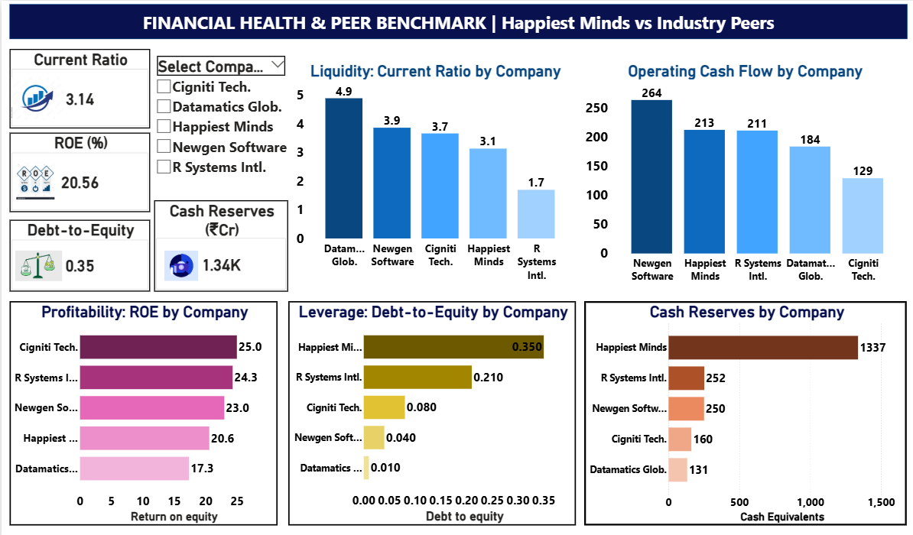
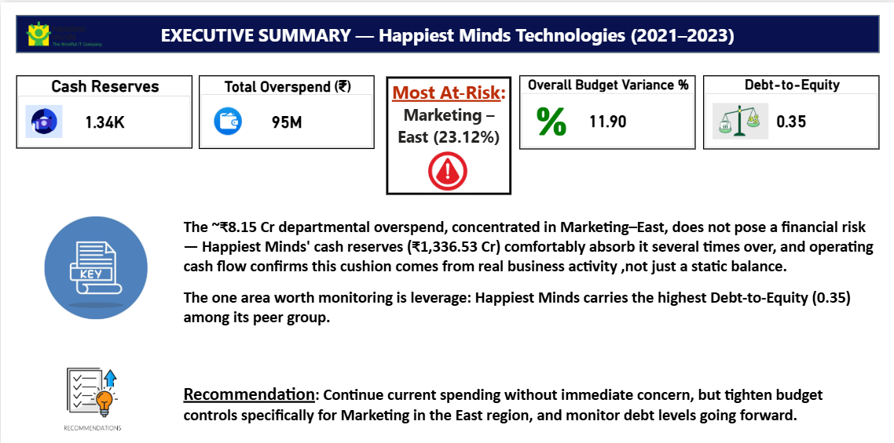

# Budget vs. Actual & Financial Ratio Dashboard
### Happiest Minds Technologies — Budget Performance & Financial Health Analysis (2021–2023)

## What this project does
Answers one question: Where is the company overspending, and can it actually afford it?

Combines an internal department budget dataset with Happiest Minds Technologies'
public financial statements to assess operational spend risk against overall financial
health, benchmarked against 4 industry peers.

> **Note on data sources:** Happiest Minds' financial figures (Sales, Profit, Ratios,
> Balance Sheet, Cash Flow) reflect real company data, sourced from a public Kaggle
> dataset compiled from BSE/NSE-listed companies' financial statements — not scraped
> or pulled directly from company filings by the author. The budget dataset is a
> separate, synthetic dataset (also from Kaggle) paired with Happiest Minds as an
> illustrative case study, since real internal department budgets are never publicly
> available for any company. This pairing demonstrates a technique real FP&A analysts
> use — checking spend risk against financial health.

## Pipeline
```
Raw data -> Python (pandas): cleaning + EDA -> MySQL: SQL analysis -> Power BI: dashboard
```

- Python: cleaned 10,010 -> 9,995 rows, removed duplicates/nulls, trimmed financial
  data to 5 companies
- MySQL: department/region/year variance queries, peer comparison joins
- Power BI: 3-page interactive dashboard connected live to MySQL

## Dashboard Pages
1. Budget Variance — department/region overspend, heatmap, year trend, KPIs, slicers
2. Financial Health & Peer Benchmark — liquidity, leverage, profitability, cash vs. 4 peers
3. Executive Summary — headline KPIs + written recommendation

## Dashboard Preview

Page 1 — Budget Variance


Page 2 — Financial Health & Peer Benchmark


Page 3 — Executive Summary


## Key Findings
- Marketing overspent the most overall (+15.06%); **Marketing × East** was the sharpest
  hotspot (+23.12%)
- Overspend peaked in 2022 (+13.64%) and improved by 2023 (+10.12%)
- Happiest Minds' cash reserves (₹1,336.53 Cr) are ~5x any peer — comfortably absorbs
  the ~₹9.5 Cr total overspend
- The one caution flag: highest Debt-to-Equity (0.35) in its peer group

## Recommendation
Continue current spending — cash reserves easily cover the overspend. Tighten controls
for Marketing in the East region, and monitor debt levels going forward.

## Tools
Python (pandas) · MySQL · Power BI Desktop

## Data
Raw datasets are not included in this repo. Source data:
- Budget vs Actual: Kaggle — "Budget vs Actual Financial Dataset"
- Financial statements: Kaggle — "Financial Sheets" dataset (BSE/NSE-listed companies)

## Files
- `01_data_cleaning_eda_part1.ipynb`, `02_data_cleaning_eda_part2.ipynb` — Python cleaning & EDA
- `budget_and_financial_queries.sql` — SQL analysis
- `budget_and_financial_health_dashboard.pbix` — Power BI dashboard

## Author
Shankarananda G T
